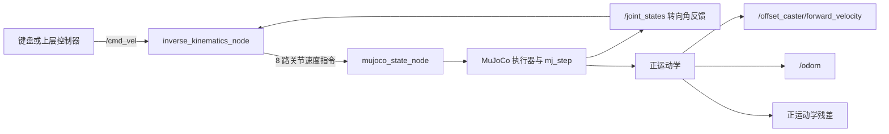

# 四偏置主动脚轮全向底盘项目概述

本项目实现了一套基于 **ROS 2 Jazzy + MuJoCo 3.12** 的四偏置主动脚轮（Powered Caster）全向底盘仿真与控制系统。底盘的四个脚轮均包含一个转向关节和一个驱动轮关节，因此可以在平面内同时控制纵向速度、横向速度和偏航角速度，即实现前后、横移、斜向移动、原地旋转及组合运动。

项目包括 SolidWorks 原始模型、STL 网格、MuJoCo MJCF 模型、正逆运动学算法、ROS 2 控制节点、键盘遥控接口和单元测试。

## 1. 主要功能

- 四个偏置主动脚轮的 MuJoCo 动力学模型与可视化。
- 接收标准 ROS 2 `geometry_msgs/msg/Twist` 速度指令。
- 根据各脚轮当前转角实时计算八个关节的目标速度。
- 将四个转向速度和四个车轮速度写入 MuJoCo 执行器。
- 从仿真关节状态反算底盘实际速度，并发布里程计与误差指标。
- 支持 `teleop_twist_keyboard` 键盘全向遥控。
- 指令超时自动置零，防止通信中断后底盘继续运动。
- 包含逆运动学、正运动学和 MuJoCo 状态读取测试。

## 2. 项目结构

```text
Offest_steeringWheel/
├── .devcontainer/                  # ROS 2 Jazzy + MuJoCo 开发容器
├── 3Dmodel/offestWheel/
│   ├── MJCF/                       # MuJoCo 模型
│   ├── STL/                        # 仿真使用的网格文件
│   └── *.SLDASM / *.SLDPRT         # SolidWorks 原始模型
├── src/offset_caster_mujoco_control/
│   ├── config/                     # 几何、限速、频率及模型路径参数
│   ├── include/                    # 正逆运动学与状态读取接口
│   ├── launch/                     # ROS 2 启动文件
│   ├── src/                        # C++ 实现
│   └── test/                       # 算法与模型集成测试
├── output/                         # 论文翻译、标注等正式文档
└── 偏置主动脚轮正逆运动学解算.md     # 理论推导资料
```

## 3. 环境要求

### 推荐方式：Dev Container

仓库已提供可直接使用的 VS Code Dev Container，推荐环境如下：

- Linux 主机（建议 Ubuntu 22.04/24.04）。
- Docker Engine。
- Visual Studio Code 与 Dev Containers 扩展。
- X11 图形环境，用于显示 MuJoCo GLFW 窗口。
- 当前容器配置使用 `--gpus=all`，因此按现有配置启动时需要 NVIDIA 驱动和 NVIDIA Container Toolkit。

容器内已配置：

- ROS 2 Jazzy。
- C++17、CMake、colcon 和 ament。
- MuJoCo 3.12.0，安装在 `/opt/mujoco`。
- GLFW3 开发库。
- `MUJOCO_DIR=/opt/mujoco`。
- 工作区挂载路径 `/workspace`。
- `ROS_DOMAIN_ID=6`。

### 原生安装

不使用容器时，建议采用 Ubuntu 24.04，并自行安装：

- ROS 2 Jazzy Desktop。
- `colcon`、`ament_cmake` 和 C++17 编译器。
- MuJoCo 3.12 C/C++ SDK。
- GLFW3 开发库。
- ROS 2 包：`geometry_msgs`、`nav_msgs`、`rclcpp`、`rosgraph_msgs`、`sensor_msgs`、`std_msgs`、`trajectory_msgs`、`teleop_twist_keyboard`。

需要将 `MUJOCO_DIR` 指向 MuJoCo 安装目录，或把该目录加入 `CMAKE_PREFIX_PATH`。默认模型路径是容器内的 `/workspace/3Dmodel/offestWheel/MJCF/offset_steering_wheel.xml`；原生运行时可通过启动参数 `model_path:=本机绝对路径` 覆盖，无需修改仓库配置。

## 4. 系统实现

### 4.1 MuJoCo 模型

`offset_steering_wheel.xml` 使用 SolidWorks 导出的 STL 作为视觉模型，并为底盘和车轮设置简化碰撞体。底盘通过 `freejoint` 在三维空间自由运动。每个脚轮包含：

- 一个绕 `z` 轴旋转的转向关节；
- 一个绕轮轴旋转的驱动关节；
- 两个速度执行器，分别控制转向速度和车轮角速度。

当前关键几何参数为：

| 参数 | 数值 | 含义 |
|---|---:|---|
| 车轮半径 | 0.075 m | 驱动轮滚动半径 |
| 偏置距离 | 0.105 m | 转向轴到车轮接地点方向的偏置 |
| 前后转向轴位置 | ±0.50 m | 相对底盘中心的 `x` 坐标 |
| 左右转向轴位置 | ±0.35 m | 相对底盘中心的 `y` 坐标 |
| MuJoCo 步长 | 0.002 s | 仿真内部运行频率为 500 Hz |

MJCF 中的质量和惯量目前是可运行的初始估计值；如用于高精度动力学研究，应替换为 CAD 或实测参数。

### 4.2 控制数据流



### 4.3 逆运动学

`inverse_kinematics_node` 订阅目标底盘速度 `/cmd_vel` 和当前转向角 `/joint_states`。对每个脚轮，算法根据底盘目标速度 `(vx, vy, wz)`、脚轮安装位置、当前转向角、车轮半径和偏置距离，计算：

- 转向关节角速度；
- 驱动轮角速度。

节点以 50 Hz 更新并发布 `/offset_caster/joint_velocity_command`。当任一关节速度超过限制时，八路指令会按同一比例缩小，从而保持各脚轮之间的运动学关系。默认限制为：

- 最大转向速度：6.283 rad/s；
- 最大车轮速度：40 rad/s。

### 4.4 MuJoCo 驱动与状态反馈

`mujoco_state_node` 将收到的八路关节速度按名称映射到 MuJoCo 的 `data.ctrl`，随后按模型步长调用 `mj_step`。节点以 50 Hz 发布关节状态和底盘状态。

底盘位姿直接取自 MuJoCo 中 `base` 刚体的世界坐标；底盘速度则由四个脚轮的转角、转向速度和车轮速度共同反算。

### 4.5 正运动学

四个脚轮共提供八个平面速度约束，而底盘只有 `(vx, vy, wz)` 三个未知量。正运动学使用 QR 最小二乘法求解超定方程组，并计算均方根残差。残差越小，表示四个脚轮的状态越符合刚体运动约束；残差异常增大通常意味着打滑、参数不一致或关节状态异常。

### 4.6 安全机制

- 逆运动学节点在 `/cmd_vel` 超过 0.5 秒未更新时发布零速度。
- MuJoCo 节点在关节指令超过 0.25 秒未更新时将所有执行器控制量置零。
- 非有限数值和缺少关节的无效消息会被拒绝。
- 逆运动学在收到全部四个转向角之前不会输出运动指令。

## 5. 构建与测试

在 VS Code 中打开 `Offest_steeringWheel` 目录并选择 **Reopen in Container**。进入容器后执行：

```bash
cd /workspace
source /opt/ros/jazzy/setup.bash
colcon build --packages-select offset_caster_mujoco_control --symlink-install
source install/setup.bash
```

运行测试：

```bash
colcon test --packages-select offset_caster_mujoco_control
colcon test-result --verbose
```

如果修改过源码，需要重新执行 `colcon build` 并在新终端中重新 `source install/setup.bash`。

## 6. 启动仿真

### 6.1 启动完整控制系统

在容器终端 1 中执行：

```bash
cd /workspace
source /opt/ros/jazzy/setup.bash
source install/setup.bash
ros2 launch offset_caster_mujoco_control simulation_control.launch.py \
  enable_viewer:=true
```

该命令同时启动逆运动学节点和 MuJoCo 状态节点。若只需要无界面仿真，可设置：

```bash
ros2 launch offset_caster_mujoco_control simulation_control.launch.py \
  enable_viewer:=false
```

原生环境或其他工作区路径下运行时，指定 MJCF 的绝对路径：

```bash
ros2 launch offset_caster_mujoco_control simulation_control.launch.py \
  enable_viewer:=true \
  model_path:=/absolute/path/to/offset_steering_wheel.xml
```

### 6.2 解决 X11 窗口权限问题

如果容器中的 MuJoCo 窗口无法打开，在主机终端执行：

```bash
xhost +si:localuser:root
```

仿真结束后撤销权限：

```bash
xhost -si:localuser:root
```

## 7. 如何操控

### 7.1 键盘操控

保持仿真运行，在容器终端 2 中执行：

```bash
cd /workspace
source /opt/ros/jazzy/setup.bash
source install/setup.bash
ros2 run teleop_twist_keyboard teleop_twist_keyboard \
  --ros-args --remap cmd_vel:=/cmd_vel
```

底盘坐标约定：`+x` 为前进、`+y` 为左移、`+z` 轴正向角速度为逆时针旋转。

常用按键：

| 按键 | 动作 |
|---|---|
| `i` | 前进 |
| `,` | 后退 |
| `j` | 逆时针旋转 |
| `l` | 顺时针旋转 |
| `u` / `o` | 前进并旋转 |
| `m` / `.` | 后退并旋转 |
| `k` 或其他不支持的按键 | 停止 |
| `Shift+J` / `Shift+L` | 向左 / 向右横移 |
| `Shift+U` / `Shift+O` | 左前 / 右前斜移 |
| `Shift+M` / `Shift+<`、`Shift+>` | 后方与斜向全向移动 |
| `q` / `z` | 同时增大 / 减小线速度和角速度 |
| `w` / `x` | 增大 / 减小线速度 |
| `e` / `c` | 增大 / 减小角速度 |

`teleop_twist_keyboard` 启动后也会在终端打印完整按键布局。终端窗口必须保持焦点才能接收按键。

### 7.2 直接发布速度指令

也可以绕过键盘节点，直接以 20 Hz 发布 `/cmd_vel`。例如以 0.5 m/s 前进：

```bash
ros2 topic pub -r 20 /cmd_vel geometry_msgs/msg/Twist \
  "{linear: {x: 0.5, y: 0.0, z: 0.0}, angular: {x: 0.0, y: 0.0, z: 0.0}}"
```

向左横移：

```bash
ros2 topic pub -r 20 /cmd_vel geometry_msgs/msg/Twist \
  "{linear: {x: 0.0, y: 0.3, z: 0.0}, angular: {x: 0.0, y: 0.0, z: 0.0}}"
```

逆时针原地旋转：

```bash
ros2 topic pub -r 20 /cmd_vel geometry_msgs/msg/Twist \
  "{linear: {x: 0.0, y: 0.0, z: 0.0}, angular: {x: 0.0, y: 0.0, z: 0.5}}"
```

按 `Ctrl+C` 停止发布后，控制器会在超时期限内自动停车。

## 8. ROS 2 接口

| 方向 | 话题 | 消息类型 | 用途 |
|---|---|---|---|
| 输入 | `/cmd_vel` | `geometry_msgs/msg/Twist` | 目标底盘速度 |
| 输入/反馈 | `/joint_states` | `sensor_msgs/msg/JointState` | 八个关节的位置与速度 |
| 内部控制 | `/offset_caster/joint_velocity_command` | `trajectory_msgs/msg/JointTrajectory` | 八个关节的速度指令 |
| 输出 | `/offset_caster/forward_velocity` | `geometry_msgs/msg/TwistStamped` | 正运动学解算的底盘速度 |
| 输出 | `/offset_caster/forward_kinematics_residual` | `std_msgs/msg/Float64` | 正运动学均方根残差 |
| 输出 | `/odom` | `nav_msgs/msg/Odometry` | MuJoCo 位姿与正运动学速度 |
| 输出 | `/clock` | `rosgraph_msgs/msg/Clock` | 仿真时间 |

常用观察命令：

```bash
ros2 topic echo /joint_states
ros2 topic echo /offset_caster/forward_velocity
ros2 topic echo /offset_caster/forward_kinematics_residual
ros2 topic echo /odom
```

## 9. 参数调整

主要参数位于：

- `config/inverse_kinematics.yaml`：运动学几何、控制频率、指令超时和关节限速。
- `config/mujoco_state.yaml`：模型路径、状态发布频率、执行器超时及可视化开关。

修改车轮半径、偏置距离或脚轮安装位置时，两个 YAML 文件中的对应参数必须保持一致，并同步检查 MJCF 几何模型。关节与执行器名称也必须与 MJCF 完全一致，否则节点会在启动时报告缺少对象。

## 10. 当前边界与后续方向

- 当前系统面向 MuJoCo 仿真，尚未包含真实电机驱动器和硬件通信层。
- `/odom` 的位姿来自 MuJoCo 真值，尚未实现纯轮式里程计的位置积分与漂移建模。
- 质量、惯量、摩擦等参数需要根据实际样机标定。
- 后续可接入 Nav2、轨迹跟踪器、真实编码器和底盘硬件接口，并增加 TF 发布、状态估计与滑移补偿。
