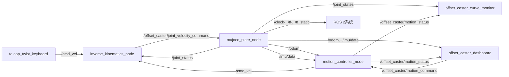
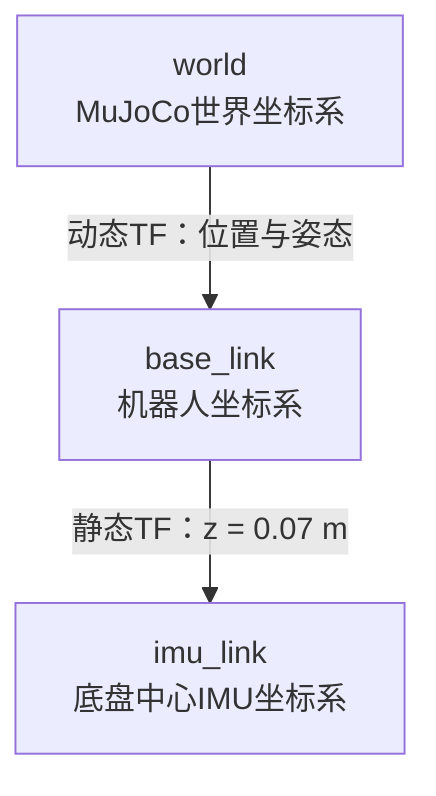

# 系统诊断、ROS 2节点图与TF树

## 1. 独立Qt实时曲线

独立程序`offset_caster_monitor`使用20秒滚动窗口显示三组数据：

| 曲线 | 数据来源 | 含义 |
|---|---|---|
| 轨迹误差 | `/offset_caster/motion_status` | 世界位置目标的欧氏距离误差，以及Yaw最短角误差绝对值 |
| 四路舵角 | `/joint_states.position` | `steering_joint_1..4` 的实际转角，单位rad |
| 四路轮速 | `/joint_states.velocity` | `wheel_joint_1..4` 的实际角速度，单位rad/s |

键盘速度模式没有位置目标，因此轨迹误差主要用于两种Qt位置模式。舵角和轮速曲线在键盘与位置控制期间都会实时更新。

单独启动监测窗口：

```bash
ros2 run offset_caster_dashboard offset_caster_monitor
```

## 2. ROS 2节点图



查看运行时节点和连接：

```bash
ros2 node list
ros2 topic list
ros2 run rqt_graph rqt_graph
```

正常情况下只应存在一套以下节点：

```text
/mujoco_state_node
/inverse_kinematics_node
/motion_controller_node
/offset_caster_dashboard
/offset_caster_curve_monitor
```

如果同名节点出现两次，说明启动了多套仿真，会造成多个`/cmd_vel`发布者互相竞争。应在多余的launch终端中按`Ctrl+C`。

## 3. TF树



其中：

- `world → base_link`由`mujoco_state_node`按状态发布。
- `base_link → imu_link`为静态变换，对应MJCF中的`imu_site`。
- `/odom`使用`world`作为父坐标系、`base_link`作为子坐标系。
- `/imu/data.header.frame_id`为`imu_link`。

运行时检查：

```bash
ros2 run tf2_ros tf2_echo world base_link
ros2 run tf2_ros tf2_echo world imu_link
ros2 run tf2_tools view_frames
```

`view_frames`会在当前目录生成TF树文件，可用于论文或视频插图。

## 4. 录制数据

录制用于离线作图的关键话题：

```bash
ros2 bag record \
  /cmd_vel \
  /offset_caster/motion_command \
  /offset_caster/motion_status \
  /joint_states \
  /odom \
  /imu/data \
  /tf \
  /tf_static
```

录制前确认Qt位置控制已经停止，避免键盘和位置控制器同时发布`/cmd_vel`。
