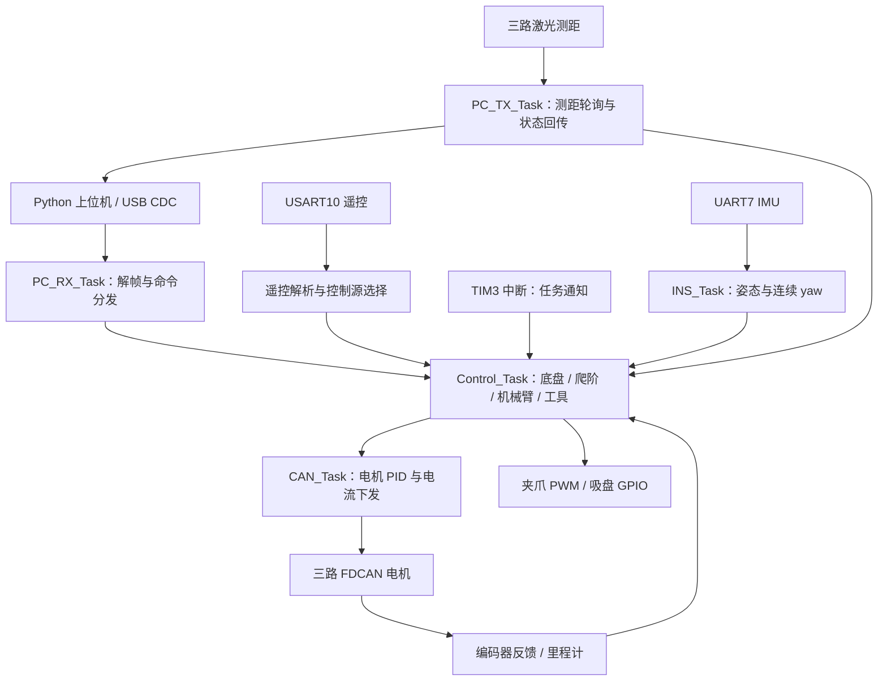

# 26_RC_02 项目解析

解析日期：2026-09-12。依据当前目录源码、工程配置、文档和现有测试；没有修改原工程，没有连接机器人或重新编译固件。

源项目：`/run/media/liselena/4CF81584F8156D88/spareE/Vinci_Robocon_2026/26_RC_Projects/26_RC_02`

## 1. 项目定位

这是面向 Robocon 机器人、代码中称为 R2 的整车嵌入式控制工程。核心是 STM32H723VGTx 上的 FreeRTOS 固件，覆盖麦克纳姆底盘、三关节机械臂、工具切换及执行、四立杆和四辅助驱动轮组成的上下台阶机构，并附带 Python 串口调试工具。

当前工程配置为 480 MHz 系统时钟、240 MHz HCLK。固件主要使用 C、STM32 HAL、CMSIS-RTOS v1/FreeRTOS；构建入口是 Keil MDK 的 uvprojx，同时保存了 AC6/CMSIS-Toolbox 的 csolution/cproject。

存在 CMSIS-DSP/NN 依赖并不能证明项目应用了神经网络。当前阅读到的主控制链路是运动学、轨迹规划、PID 和有限状态机。

## 2. 目录与代码规模

以下按 C/H/Python 文件的物理行统计，含注释、空行和部分生成/移植代码，不能直接等同于原创工作量。

| 目录 | 内容 | 文件数 / 行数 |
|---|---|---|
| Applications | 任务、底盘控制、上下台阶、激光应用、yaw 调参 | 18 / 7,320 |
| BSP | CAN、UART、USB、激光串口、板级初始化 | 14 / 890 |
| Components | 运动学、规划器、协议、PID、电机、IMU、工具 | 37 / 8,445 |
| Core | main、外设初始化、中断、RTOS 配置 | 22 / 4,191 |
| USB_DEVICE | USB CDC 接口及设备适配 | 8 / 2,526 |
| PC_USB_Serial_Tool | Python 命令行、协议解析、状态解码、测试 | 10 / 2,620 |
| Drivers / Middlewares | ST HAL、CMSIS、FreeRTOS、USB 库 | 未计入上表 |
| Mechanical_Arm_Model | 机械臂参数、零位、坐标轴与拓扑资料 | 文档与 SVG |
| Upper_Cptr | Nav2、FAST-LIO、Livox 等配置 | 仅看到 nav2_params.yaml |

复杂度最集中的文件为 R2_climb.c（2,253 行）、PC_TX_Task.c（1,233 行）、Data_Analysis.c（971 行）、R2_move.c（800 行）。

## 3. 运行架构

main 初始化 GPIO、DMA、FDCAN1/2/3、定时器及串口，创建 RTOS 任务并启动调度器。Control_Task 启动延时 5 秒后初始化 USB、板级电机控制、两套运动/爬阶控制器、机械臂与工具，再启动 TIM3。

| 任务 | 优先级 | 设计节拍 | 职责 |
|---|---|---|---|
| Control_Task | Realtime | 1 ms 通知驱动 | 里程计、yaw、运动更新、爬阶、看门狗、遥控与工具 |
| CAN_Task | High | 循环末尾 osDelay(1) | 选择控制源、取目标快照、运行 PID、下发电流 |
| INS_Task | High | osDelay(1) | IMU 初始化、数据快照、连续 yaw、在线判断 |
| PC_RX_Task | AboveNormal | osDelay(1) | 读取 USB ring buffer 并逐字节解帧 |
| PC_TX_Task | Normal | osDelay(5) | 状态请求响应，并每约 10 ms 调用激光轮询 |

这些是代码设定的节拍，尚未测量实机抖动或最坏执行时间。TIM3 ISR 当前只调用任务通知；控制计算已经迁移到任务内。

## 4. 硬件控制分工

| 接口 | 当前源码用途 |
|---|---|
| FDCAN1 电机 1–4 | 四麦轮，FR、BR、BL、FL |
| FDCAN1 电机 5–6 | 前侧两辅助爬阶驱动轮 |
| FDCAN2 电机 1–4 | 四根升降立杆 |
| FDCAN2 电机 5–6 | 后侧两辅助爬阶驱动轮 |
| FDCAN3 电机 1–3 | 机械臂 J1/J2/J3 |
| FDCAN3 电机 4 | 夹爪位/吸盘位旋转切换 |
| UART7 | HWT605 IMU，循环 DMA + 空闲接收，含缓存维护 |
| USART10 | 遥控接收，115200；代码还包含机械臂回显链路 |
| USART1 / UART8 / UART9 | X / Y / 高度三路激光测距 |
| TIM1 CH1 / GPIOE | 夹爪舵机 PWM / 吸盘开关输出 |

按当前电流输出通道，最多涉及 16 个 CAN 电机通道；实际装配与电机方向仍须对照接线和实机。

## 5. 关键功能

### 底盘

R2_move 提供 8 种模式：机器人/世界坐标 × 锁定/改变朝向 × 速度/位置控制。底盘坐标定义为 X 向右、Y 向前、yaw 逆时针。

速度模式采用斜坡平滑。位置模式在 speedPlanner.c 内使用五次多项式 S 形轨迹，结合速度前馈、位置 P 环与 yaw 控制。编码器增量用于平移里程计；IMU 在线时提供绝对朝向，离线时保留编码器 yaw 积分路径。

这是编码器里程计结合 IMU 朝向的实现；当前主链路没有看到完整 EKF 状态融合或 SLAM 实现。

### 机械臂

arm_ik_3r_safe_stm32h7.c 负责三转动关节正逆运动学与安全判断；arm_user.c 负责目标接受、模型角到电机角映射、保持历史安全目标和反馈。

当前两连杆长度为 320 mm + 320 mm，模型参考角为 0°、80°、−165°。J1 输出限制 ±180°，低于或等于 250 mm 的目标受 XZ 平面限制；代码还有分段关节安全区及保守的目标包络。不可达/不安全目标返回错误并保留安全输出。

机械臂文档坐标为 X 向前、Y 向左、Z 向上，与底盘的 X 向右、Y 向前不同，集成时必须明确转换。这里的保护针对目标及关节限制；不能仅据此认定运动全过程完成了碰撞检测。

### 工具

工具包含三个不同动作：CAN 电机旋转选择夹爪位或吸盘位；PWM 控制夹爪开合；GPIO 控制吸盘开关。USB 与 USART 各自保存工具状态。当前 CAN_Task 已将工具旋转目标接入第 4 路位置/速度级联 PID。

### 上下台阶

R2_climb.c 使用动作表驱动状态机：上台阶 14 个主步骤，下台阶 15 个主步骤，另有准备、接近、完成、错误等状态。支持单步、自动、单动作调试、自动暂停与继续。

上台阶自动接近使用 X 测距 0 ≤ x < 35 mm 作为触发条件；下台阶以高度 h > 65 mm 触发并继续后退 5 mm。连续测距失效和动作超时有相应错误路径。

当前立杆范围 −30 至 260 mm，待机为 −30 mm。动作表协调前后立杆、前后辅助轮及麦轮，并通过位置误差判断到位。YAML/JSON 保存动作说明与调试流程；实际固件执行以 C 动作表为准，没有看到 MCU 运行时读取 YAML 的链路。

### 自动调参与上位机

R2_yaw_autotune.c 内置覆盖 8 种底盘模式的测试路径，记录 yaw 误差、角速度误差和振荡信息，按阈值规则有限幅地调整角度/角速度 PID 与 yaw 位置增益。它是规则式在线调参实现，实际改善效果需试验数据支持。

Python 工具基于 Python ≥3.9 和 pyserial，提供串口枚举、交互 shell、命令/原始十六进制发送、流式解帧、JSON 状态输出，以及爬阶动作等待、记录、恢复和流程导出。

## 6. 协议与控制语义

USB 帧：`A5 5A LEN CMD DATA CRC_H CRC_L FF`。CRC 使用 Modbus 多项式 0xA001，但帧内 CRC 顺序是高字节在前。含参数的常用控制命令为 4 个 little-endian float，共 16 字节；部分无参数命令可用空 payload。

USART 遥控帧：`A5 + 40 字节 DATA + 1 字节累加校验 + 5A`。前 16 字节为模式/机构标志，后 24 字节是 6 个 float。

上电默认 USART 源。USB 命令通常先切 USB，再使能对应模块。USB 底盘速度看门狗为 100 ms，机械臂为 300 ms，工具为 2000 ms，USART 控制超时为 300 ms。底盘位置任务与自动流程存在主动解除速度看门狗的逻辑，不能把所有动作都理解为断开串口立即停。

还需注意：SYS_STOP 的源码主要停止 USB 那套底盘/爬阶并保持 USB 机械臂、停止 USB 工具；它不是可以直接视作独立于控制源的硬件急停。ARM_DISABLE 会保持当前目标附近的位置，CAN_Task 仍调用关节 PID，因此“失能”也不等于电机输出电流归零。

## 7. 文档与当前源码差异

2026-06-11 的 PROJECT_AUDIT_REPORT.md 是历史材料，以下内容已经改变：

- 任务由报告中的 4 个变成 5 个，INS_Task 已有实际业务。
- FDCAN filter 使用统一局部索引 0，旧报告中的 7/14 问题不再适用于当前实现。
- USB 参数读取已检查 payload 必须为 16 字节。
- 工具状态机独立于 USART 条件执行，工具电机目标也已接通。
- CAN 启动延时改成 osDelay(5000)，控制计算改用任务通知驱动。
- 控制源标志改为 volatile，默认 USART 激活。

AVAILABLE_COMMANDS.md/部分 README 仍有 −10 mm 待机或测试动作名称，而当前代码与 Python 状态表使用 −30 mm。旧审计里的 36 字节遥控数据也已变为 40 字节。机械臂旧矩形坐标限制说明与新工作空间预检查不能混用。

## 8. 验证结果与局限

本次实际运行：

- `python3 -B tools/verify_control_plan.py`：通过。这是源码结构断言和基础数学检查。
- 在 PC_USB_Serial_Tool 中执行 `python3 -B -m unittest discover -s tests -v`：20 项全部通过，覆盖协议帧、CRC、状态解码和部分命令。

已有 Keil 构建日志记录 0 errors / 0 warnings，程序大小 Code=163848、RO-data=4340、RW-data=1148、ZI-data=85948。这里只能证明历史构建记录；当前环境 PATH 未找到 cbuild、armclang 或 arm-none-eabi-gcc，没有重新构建，不能保证现存二进制与所有当前源文件一致。

没有进行串口通信、下载、实机运行或控制精度测试。目录中的 .git 为空，不能从该目录确认提交历史和个人贡献。附带 .venv 是 Windows 环境，Linux 需要另建虚拟环境。

进一步审查时值得优先处理：USB 通用 float 读取只有长度检查，未见统一 NaN/Inf 拒绝；例如 NaN 能绕过普通大小比较限幅并进入速度目标。另需测量 1 ms 控制超时时的行为：当前等待超时会主动执行一步，积压通知也会连续补算，尚未验证这种时间处理与实机时钟的一致性。

## 9. 推荐阅读顺序

先读 main.c、freertos.c 和 Control_Task.c 理解启动与调度；再读 Data_Analysis.c、CRC.c 理解输入和控制源；然后看 R2_move.c 与 CAN_Task.c 串起目标到电流输出；最后按机构深入 R2_climb.c、arm_user.c、arm_ik_3r_safe_stm32h7.c、arm_tools.c，并结合 PC_TX_Task.c 与 Python status.py 查看反馈。

Upper_Cptr 只有一份导航参数文件，引用外部 ROS 包。这一目录不足以复现完整导航系统，也不能据此推定导航已经联调完成。
