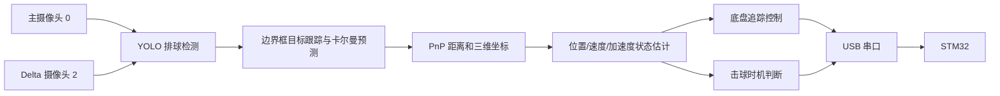

# vo 上位机项目解析

仓库：<https://gitee.com/wyzyoi/vo>  
分析版本：`4191b2f`（2025-07-04，master）

## 项目定位

这是一个排球机器人视觉上位机原型。程序使用主摄像头和近距离 Delta 摄像头检测排球，通过 PnP 估计排球三维位置和距离，再用卡尔曼滤波估计位置、速度、加速度和加加速度。控制器根据球的位置驱动三轮底盘横向对齐，并在球进入动态击球范围时触发 Delta 或 CyberGear 击球机构。



## 文件结构

| 文件 | 作用 |
|---|---|
| `main.py` | 主程序，创建模型、相机、滤波器、控制器和串口线程，运行双相机控制循环 |
| `func.py` | 图像采集、YOLO检测、PnP封装、目标跟踪、卡尔曼滤波、控制策略和可视化 |
| `func_send.py` | USB串口自动选择、上下位机协议、模式状态机、数据发送和电机反馈接收 |
| `pnp.py` | PnP测距、坐标变换、相机参数读取等基础函数 |
| `distance_test.py` | 单摄像头测距和滤波调试程序 |
| `gpu_test.py` | CUDA矩阵乘法性能测试，与机器人业务无直接关系 |
| `model/best24v8n_1536.pt` | 主摄像头YOLO权重，约6.1 MB |
| `model/best_delta1v8n.pt` | Delta近距离摄像头YOLO权重，约6.0 MB |
| `model/camera6` | 一组相机内参与畸变参数 |
| `model/camera3_135` | 另一组相机内参与畸变参数 |

仓库没有 `README`、`requirements.txt`、自动化测试或安装脚本。

## 主程序数据流

1. 加载两个YOLO模型。
2. 打开编号0和2的摄像头。主摄像头请求1920×1080、91 FPS，近距离摄像头请求640×480、120 FPS。
3. 两个检测线程分别运行YOLO排球检测。
4. 根据检测框的上、下、左、右四个特征点执行PnP测距。
5. 使用24状态边界框卡尔曼滤波器跟踪目标，目标短暂丢失时预测后续框位置。
6. 对三维位置执行滑动平均，再用四状态卡尔曼滤波器估计每个轴的`位置、速度、加速度、加加速度`。
7. 远距离时依据主摄像头三维位置进行底盘对齐，近距离时依据Delta摄像头图像坐标微调。
8. 根据球的距离、接近速度和高度计算是否进入击球条件。
9. 通过115200波特率USB串口向STM32发送底盘及击球指令。
10. 显示两个相机画面、FPS、距离、速度和加速度，按`q`退出。

## 视觉算法

### 排球检测

`Detection`在独立线程中调用Ultralytics YOLO。置信度设计为随距离变化：近距离约0.10～0.15，远距离逐步提高。不过主程序没有调用`update_distance()`，因此检测器内部距离始终为0，实际置信度基本固定在0.10。

当画面存在多个检测框时，`detection_ball()`遍历全部结果但只保留最后一个框，没有依据置信度、面积或历史轨迹选球。

### 跟踪与状态估计

- `TargetTrack`综合相邻帧框IoU与距离变化判断是否为同一目标。
- `KFBbox`对四个边界框特征点的位置、速度和加速度建模，允许最多约5帧预测。
- `KFV`分别估计排球三个轴的`x、v、a、j`。
- PnP把排球近似为半径120 mm的四点平面模型，并使用相机内参和畸变参数求解距离。
- 主摄像头坐标经过固定平移`t=[0,113,925] mm`和欧拉角旋转后转换到机器人参考坐标系。

## 底盘控制策略

上位机内部有四个PID，分别用于主摄像头和近距离摄像头的两个方向对齐。当前主程序设置的控制输出倍率为`20、15、10、10`，单轴命令限制为±3500。

当前代码最终只发送：

```python
[mx, 0.0, 0.0]
```

因此实际只启用了一个底盘平移轴；计算出的`my`没有发送，旋转轴也固定为0。目标连续丢失超过10帧后输出归零。

## 击球策略

### Delta

程序按球的接近速度动态增加击球距离阈值。当满足以下条件时触发：

- 主相机距离或Delta相机距离进入动态阈值；
- 球的主方向速度小于`-100`；
- 球高度处于180～2500 mm；
- 击球冷却时间已经结束。

原代码触发后依次发送三组数据：

```text
[90, 90, 90]
等待约0.45 s
[40, 40, 40]
等待约0.45 s
[15, 0, 0]
```

这三组数在原设计中显然被当作三个Delta电机角度，而不是末端`x、y、z`坐标。

### CyberGear

`send_xiaomi()`实现了蓄力和击发逻辑，但主程序中的调用被注释，因此默认运行时不会使用这条路径。

## 串口协议

上位机试图发送两类帧。

命令帧：

```text
A5 | 00 | CMD | 5A
```

数据帧：

```text
A5 | N | N个float32 | SUM8 | 5A
```

命令号包括：

| 命令 | 上位机含义 |
|---:|---|
| `0x01` | 底盘本体速度模式 |
| `0x03` | 底盘位移模式 |
| `0x06` | 开启反馈发送 |
| `0x07` | 关闭反馈发送 |
| `0x08` | CyberGear蓄力 |
| `0x09` | CyberGear击发 |
| `0x0B` | 启用Delta |
| `0x0C` | 禁用Delta |

## 与当前STM32工程的兼容性

命令帧格式和`0x01、0x03、0x06～0x09、0x0B、0x0C`命令号基本一致，但数据帧目前无法被STM32接受。

### 1. 校验字段长度错误

上位机使用`struct.pack('i', checksum)`发送校验值，实际写出4字节；STM32只读取1字节SUM8，随后立即等待`0x5A`。因此STM32读到校验后的第一个补零字节时会判定尾字节错误，整个数据帧被丢弃。

上位机应改为只发送一个无符号字节：

```python
ser.write(struct.pack('<B', checksum))
```

### 2. Delta数据语义不一致

当前STM32固件规定6个浮点数的后三项为Delta末端笛卡尔坐标`x、y、z`，单位为米；本上位机发送的是三个关节角度，如`[90,90,90]`。按当前下位机逆运动学，这些目标会被判定为不可达并停止电机。

需要选择一种统一方案：上位机计算末端轨迹并发送米制`x、y、z`，或者扩展下位机协议增加独立的关节角控制模式。当前下位机已有逆运动学，推荐上位机发送末端坐标。

### 3. 缺少周期保活

`Sender.main()`只在数据与上一帧不同时发送。当前STM32要求启用Delta后每500 ms内收到新的6浮点数据帧，否则自动停止。静止目标或数值不再变化时，上位机不会重发，会触发下位机超时。发送器需要增加固定周期心跳，例如50～100 Hz持续发送最新目标。

### 4. 回传协议缺少帧结构

上位机接收器按连续三个`int16`读取底盘电机转速，与STM32的6字节电机转速回复相符；但接收列表返回后没有清空，第二次接收不会再次得到三电机结果。STM32的运动到位状态和Delta状态是单字节裸数据，上位机也无法区分这些数据和电机转速字节流。

## 当前无法直接运行的原因

1. `main.py`导入了仓库中不存在且未使用的`test`模块。
2. `CAMERA_PATH_DELTA`指向`model/camera1`，仓库实际没有该目录，只有`camera6`和`camera3_135`。
3. 模型和标定路径使用Windows反斜杠；在Linux上不会解析为仓库中的文件。
4. 没有依赖清单。根据导入语句至少需要Python 3.10、OpenCV、NumPy、PySerial、SciPy、Ultralytics、scikit-learn、PyTorch。
5. YOLO调用同时传入`half=True`和`fp16=True`；`fp16`并不是多数Ultralytics版本接受的预测参数，可能在运行时抛出参数错误。
6. USB串口自动选择第一个描述中含`USB`的设备，多设备环境可能选错端口。
7. `Sender`不做线程同步，主线程和发送线程并发读写目标数组和状态。

## 其他已发现问题

- `PID.output()`没有更新`_last_error`，D项实际一直使用`当前误差-0`。
- 主控制每帧调用`set_target()`，该函数会清零积分，因此主摄像头PID的I项基本不能积累。
- `stay_distance=0`本意似乎是关闭纵向跟随，但`set_y_target()`拒绝小于100的目标后保留了默认1500 mm目标。
- 操作码8判断了错误的Delta状态位，可能导致CyberGear关闭命令不执行。
- `Receiver.get_data()`得到三个值后不清空缓存；`Sender.get_speed()`还会把Receiver对象覆盖成返回数组。
- 检测线程和视频线程都是无限循环，使用`1e-7`秒休眠，容易持续占用CPU。
- `Detection`线程没有退出条件，程序退出时只把检测置为关闭，线程本身仍然存活。
- `get_distance()`在尚未建立可靠检测框时仍可能对全零预测点调用PnP，容易产生无效距离。
- 仓库只包含一个提交，缺少版本说明和可重复运行配置。

## 结论

这个项目已经搭出了排球机器人上位机的完整原型链路：双相机采集、YOLO检测、PnP三维定位、卡尔曼状态估计、底盘跟踪和击球触发都已有代码。不过它目前属于实验性快照，干净克隆后不能直接启动，也不能直接控制当前STM32工程。优先修复顺序应为：运行路径和依赖、串口校验字节、周期保活、Delta坐标协议、PID状态更新、接收帧格式，最后再进行双相机标定和实机参数整定。
