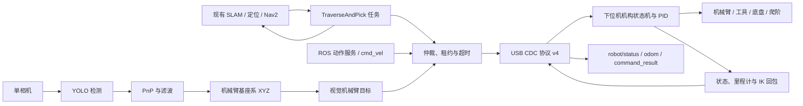

# 武林探秘 R2 上下位机功能核查

核查日期：2026-09-13。范围为本目录的 `26_RC_02/` 与 `vo2/`，以当前应用源码、任务调用、命令分发和 ROS 节点为依据。

当前分工：下位机负责整车运动与机构执行；vo2 负责视觉定位、USB 通信、动作仲裁和 ROS 2 控制接口。上位机现已接通机械臂、夹爪/吸盘、底盘本地定位、定时定速移动、相对/本地位姿移动及上下台阶命令，并根据下位机回包发布执行结果。在已有 SLAM 地图、定位和 Nav2 的条件下，新增的任务节点可按地图目标点依次执行导航、上/下台阶、视觉目标稳定、预抓取、夹取/吸取和撤回。

本文中的“已实现”表示源码中存在执行路径并完成主机侧协议/状态机测试。此前迁移验证通过了主机侧检查和 ROS 构建测试；本次未检测到 `/dev/ttyACM*` 或 `/dev/ttyUSB*` 设备，因此没有验证真机串口、实际运动、视觉精度或重新编译完整 STM32 固件。

## 下位机：26_RC_02

平台为 STM32H723 + FreeRTOS。控制、CAN、INS、USB 接收、状态发送共五个任务已创建。控制任务按名义 1 ms 步进，硬件定时中断负责通知任务。

| 功能 | 当前源码能完成的动作 | 边界 |
|---|---|---|
| 四麦克纳姆轮底盘 | 前后、左右、斜向平移、原地转向及平移与转动组合 | 实际速度和精度取决于轮径、减速比、安装方向和 PID |
| 八种运动模式 | 机器人/世界坐标 × 速度/位移控制 × 锁定/改变 yaw | 世界坐标来自本地里程计参考系，未接入地图全局定位 |
| 速度与位移控制 | 速度斜坡平滑；按指定 dx、dy、dyaw 做 S 形轨迹规划、位置反馈和轮速闭环 | 位移命令是相对运动，不能直接当作地图导航目标 |
| 姿态与里程计 | HWT605 姿态、角速度、加速度读取；连续 yaw；编码器平移积分；IMU 在线时修正朝向 | 当前为编码器里程计结合 IMU 朝向，未见完整 EKF/SLAM；位置仍会累计误差 |
| 三关节机械臂 | 接收基座系 XYZ，正逆运动学、关节目标转换、位置/速度级联 PID、保持位置、IK 结果反馈 | 有可达性、关节联动、工作空间和低位锁平面限制；未见全过程避障规划 |
| 末端工具 | 电机旋转切换夹爪位/吸盘位；PWM 驱动夹爪舵机；GPIO 控制吸盘；切换到位与超时判断 | 工具开关及旋转状态不等于已经检测到抓取成功 |
| 上台阶 | 激光接近判断、准备动作和固定 14 步机构序列 | 为给定机构和场景编写的预设流程，不能推定可适应任意台阶 |
| 下台阶 | 高度激光接近判断、准备动作和固定 15 步序列 | 同上 |
| 爬阶调试 | 单步、自动、指定中断点暂停、继续、停止，以及 38 个单项测试动作 | 立杆和前后辅助驱动轮须完成零位与方向确认 |
| 三路激光测距 | X、Y、高度通道的轮询、原始/偏移后距离、有效性与在线状态 | X/Y 为通道名；未看到利用三路测距实现通用地图定位 |
| yaw 自动整定 | 运行八段速度/位置测试轨迹，采样误差、评分并有限调整控制增益，最多三轮 | 属于规则驱动调参；未见将整定增益写入非易失存储的路径 |
| USB/USART 控制 | USB CDC 命令、USART 遥控帧、控制源切换、模块使能和停止 | SYS_STOP 等 USB 路径主要操作 USB 控制状态；不能视作跨控制源硬件急停 |
| 状态诊断 | 查询系统、底盘、机械臂、工具、爬阶、yaw 整定与整车综合状态；USB 异步 IK 结果 | UART10 的六字节 IK 结果发送扩展点为空实现 |
| 超时处理 | USB 速度指令超过 100 ms 停止；机械臂超过 300 ms 未更新且未到位时保持当前位置；工具切换有约 2 s 超时 | 机械臂保持仍由 PID 输出电流，“失能”不等于电机断电 |

电机通道分工：FDCAN1 为四麦轮和前侧两辅助轮；FDCAN2 为四立杆和后侧两辅助轮；FDCAN3 为三个机械臂关节和一个工具切换电机，共涉及 16 个 CAN 电机输出通道。夹爪舵机与吸盘另走 PWM/GPIO。

机械臂目标高度 z ≤ 250 mm 时存在锁平面检查，不能任意横向摆动。旧命令文档中的 X/Y ±500 mm、Z 50–500 mm 描述不能作为当前实际完整工作区：当前 ARM_SET_TARGET 路径调用 ArmIK_TargetInputAllowed/Arm3R_Solve，其几何与分段安全检查才是实际判据。

主要代码入口：

- [底盘模式与控制器](26_RC_02/Applications/App_user/Inc/R2_move.h)
- [控制任务与里程计](26_RC_02/Applications/Task/Src/Control_Task.c)
- [电机执行与通道映射](26_RC_02/Applications/Task/Src/CAN_Task.c)
- [上下台阶状态机](26_RC_02/Applications/R2_user/Src/R2_climb.c)
- [机械臂目标校验](26_RC_02/Components/Algorithm/Src/arm_user.c)
- [机械臂运动学与安全区](26_RC_02/Components/Algorithm/Src/arm_ik_3r_safe_stm32h7.c)
- [工具执行](26_RC_02/Components/Device/Src/arm_tools.c)
- [命令分发与看门狗](26_RC_02/Components/Algorithm/Src/Data_Analysis.c)
- [状态回传与激光轮询](26_RC_02/Applications/Task/Src/PC_TX_Task.c)

## 上位机：vo2

vo2 包含 msg_interface、target_detection、pnp_solve、robot_serial_bridge、r2_mission 五个 ROS 2 包。

| 功能 | 当前源码能完成的动作 | 边界 |
|---|---|---|
| 单相机采集 | 使用本地相机，配置设备编号、分辨率、目标帧率 | 默认请求 640×480、30 FPS；并非实测推理帧率 |
| YOLO 检测 | 加载随附 yolov8n_test.pt 或指定模型；输出全部检测框、类别和置信度 | 可识别类别取决于权重；未做本次实物识别验证 |
| 检测显示 | OpenCV 窗口显示标注结果，也支持无窗口运行 | 当前没有完整机器人操作面板 |
| 目标选择 | 按类别名和最低置信度筛选，选最高置信度目标用于 PnP | 没有跨帧目标 ID 关联，多目标时可能切换对象 |
| 三维位置估计 | 用检测框上下左右中点、已知目标尺寸、相机内参和畸变参数进行 PnP，输出 XYZ 和距离 | 属于基于框和尺寸假设的估计；默认半径 0.12 m，不能对任意物体保证准确 |
| 坐标转换 | 光学坐标转 X 前/Y 左/Z 上，再应用安装旋转和平移，默认输出 arm_base_link | 相机相对基座外参须标定；目前为固定外参，不是随关节动态更新的手眼变换 |
| 滤波与短时预测 | 三轴位置/速度卡尔曼滤波；空检测时默认最多预测 10 帧，再发布无效结果 | 不是弹道/落点或击球时机预测；内部速度未通过 PnpResult 对外发布 |
| ROS 消息输出 | yolo_result/pnp_result 发布检测与定位；robot/status 发布 JSON 整车反馈；robot/command_result 发布动作结果；robot/odom 发布本地里程计，并可发布 odom→base_link TF 和平面协方差 | 尚未发布机械臂 JointState 或关节 TF |
| 双向 USB 桥 | 流式解析分包和噪声，校验 CRC、命令与长度，只接受 FLU 协议 v4；通信中断后停止并重连 | 串口输出仍默认关闭，真机需显式启用并刷入匹配固件 |
| 机械臂控制 | 可通过服务发送毫米 XYZ，也可续租视觉目标；持续刷新目标满足 300 ms 看门狗，并用 IK 与编码器误差确认结果 | 下位机最终决定工作空间安全；停止表示当前位置闭环保持 |
| 吸盘夹爪控制 | 可选择夹爪/吸盘位置，控制夹爪开合和吸盘开关，并确认旋转到位与输出状态 | 没有物体抓牢/吸牢传感反馈 |
| 底盘定位和运动 | 发布编码器+IMU 本地 odom；支持限时定速、cmd_vel 续租、机器人系相对位移和本地 odom 目标位姿 | 本地里程计会漂移，不是地图定位或 SLAM |
| 上下台阶控制 | 支持完整上/下台阶、单步、门控、预设暂停/继续、停止和 1–38 测试动作；执行时独占底盘 | 依赖下位机预设机构序列和真机传感器/零位 |
| Nav2 任务编排 | `TraverseAndPick` 动作可导航到地图中的越障点和抓取点，串接上/下台阶、目标稳定、预抓取、接近、夹取/吸取和撤回 | 依赖外部 SLAM/定位/Nav2；越障点和类型由任务给出，不能自动识别任意未知地形 |
| 动作安全与反馈 | 控制源确认、模块互斥、有限值/范围检查、速度和视觉输入租约、操作超时、停止与故障结果 | 服务 accepted 仅表示桥接受请求，完成状态需监听 command_result |
| 启动与配置 | launch 同时启动检测、PnP 和串口桥；模型、标定和安装参数可配置 | 示例标定默认被拒绝；不能直接把示例值当作真机标定 |

主要代码入口：

- [相机与检测](vo2/src/target_detection/target_detection/target_detection.py)
- [目标选择、滤波和输出](vo2/src/pnp_solve/pnp_solve/pnp.py)
- [PnP 求解](vo2/src/pnp_solve/pnp_solve/solver.py)
- [坐标与目标几何](vo2/src/pnp_solve/pnp_solve/geometry.py)
- [串口发送桥](vo2/src/robot_serial_bridge/robot_serial_bridge/serial_bridge.py)
- [导航越障抓取任务](vo2/src/r2_mission/r2_mission/mission_server.py)
- [任务动作使用说明](vo2/src/r2_mission/MISSION.md)
- [联合启动](vo2/src/pnp_solve/launch/vo2.launch.py)

## 两端联合工作程度

启用串口、取得 USB 控制源后，上位机可向下位机发起各机构动作。服务应答中的 `accepted` 只表示请求已通过上位机校验；后续 `robot/command_result` 才表示下位机反馈到位、停止、拒绝、超时或故障。已有 SLAM 地图时，定位系统还需提供 `map→odom`，Nav2 需提供 `/navigate_to_pose` 并向 `/cmd_vel` 输出速度。串口桥默认提供 `odom→base_link`，任务服务器据此串接地图导航与机构动作。实际效果仍要求相机标定、目标尺寸、机械臂零位、底盘参数和爬阶机构传感器正确。

当前自动任务可以完成“到指定台阶入口→执行指定上/下台阶→到指定抓取区→根据视觉坐标夹取/吸取”。仍需补齐或通过真机确认的能力：

1. SLAM、地图服务器、定位、Nav2 参数和障碍物传感链路不在 vo2 内，须由现有导航系统提供并在真车上调通。
2. 地形入口和 `up`/`down` 类型由任务目标指定；现有三路激光供固定爬阶流程使用，无法可靠完成任意未知地形的自主识别和路线选择。
3. 动作成功能确认机械臂到位及夹爪/吸盘输出状态，但没有抓牢或吸牢传感器，无法闭环判断物体是否在运输途中脱落。
4. 当前动作覆盖一次越障和一次抓取。多目标排序、放置、回程等整场比赛策略仍需按赛题目标点继续编排。
5. 真机故障恢复仍需结合实物建立，包括传感器失效、机构卡滞、台阶流程失败后的安全退回策略。

## 随附 PC 串口调试工具

26_RC_02/PC_USB_Serial_Tool 是独立的电脑端命令行调试工具，与 vo2 是两个程序。它能列出串口、打包/发送 USB 指令、解析各机构状态、交互控制底盘/机械臂/工具/爬阶、轮询动作完成，并记录和导出爬阶调试流程 JSON。vo2 现在提供同类机构控制的 ROS 2 接口，并额外接入视觉目标、cmd_vel、odom 和动作结果话题。

## 验证记录与文档适用范围

2026-09-13 已验证：下位机控制计划检查和坐标数学 C 测试通过，PC 工具 21 项协议测试通过；上下位机 34 个命令编号的空帧和四浮点帧逐字节一致。vo2 在 ROS 2 Jazzy 容器中五个包构建成功，colcon 汇总 49 项测试无错误、失败或跳过，其中包含模拟固件双向握手、协议解析、单项动作状态机、视觉目标稳定和完整导航越障抓取调用顺序测试。测试不覆盖全部固件时序、真实 Nav2 运行、真实相机效果和机构实机动作；vo2 README 推荐 Humble，上述实际构建验证使用 Jazzy。

- 根目录的 [26_RC_02_项目解析.md](26_RC_02_项目解析.md) 为坐标统一前的历史解析，其中 X 右/Y 前的描述已经过时；当前两端均为 X 前/Y 左/Z 上、yaw 逆时针为正。
- 根目录的 [vo_上位机项目解析.md](vo_上位机项目解析.md) 描述另一个双相机排球 vo 项目，含底盘跟踪与击球功能；不能用于说明本目录 vo2 的能力。
- 当前功能以本报告和实际代码为准，协议语义参照 [下位机坐标说明](26_RC_02/COORDINATE_SYSTEM.md) 与 [vo2 说明](vo2/README.md)。
